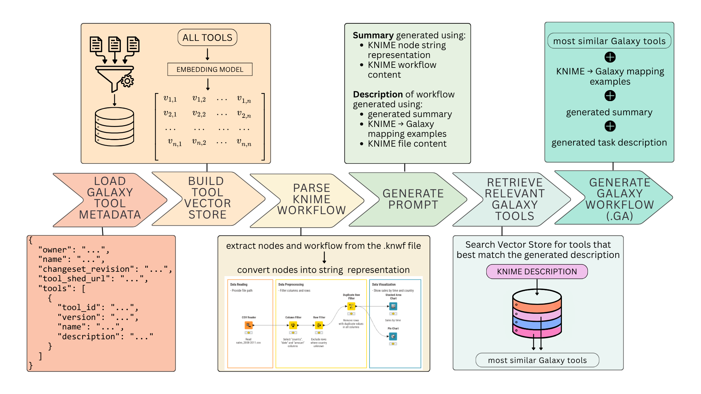

# KNIME2Galaxy Workflow Translator
Translate KNIME workflows (`.knwf`) into valid Galaxy workflows (`.ga`) using embedding-based tool retrieval and LLM-guided workflow reconstruction.

## Overview

This project translates KNIME workflows into functionally equivalent Galaxy workflows.
It combines:

- Galaxy tool metadata to represent available tools  
- Mapping examples to guide translation  
- Embedding-based similarity search to retrieve relevant tools  
- Structured LLM prompting to generate valid Galaxy `.ga` workflows

## Installation

This project uses a `pyproject.toml` setup.

### Clone the repository

```bash
git clone https://github.com/rmassei/imaging_KNIME_to_Galaxy.git
cd imaging_KNIME_to_Galaxy
```

### Create a virtual environment

**Using Python venv**

```bash
python -m venv .venv
source .venv/bin/activate      # macOS/Linux
.venv\Scripts\activate         # Windows
```

**Using Conda**

Create a new environment:

```bash
conda create -n knime2galaxy python=3.10
```

Activate the environment:

```bash
conda activate knime2galaxy
```

### Install the package

```bash
pip install -e .
```

## How It Works

<p align="center">
  
  <br>
  <em>Schematic figure of the KNIME2Galaxy pipeline</em>
</p>

1. **Load Galaxy Tool Metadata**  
   Metadata is loaded and converted into structured text representations.

2. **Build the Vector Store**  
   Tool descriptions are embedded and stored in a vector index for similarity search.

3. **Parse the KNIME Workflow**  
   The `.knwf` file is unpacked to extract nodes and workflow structure.

4. **Generate Workflow Understanding via LLM**  
   The KNIME content is combined with example mappings and passed to an LLM to produce structured workflow and node descriptions.

5. **Retrieve Relevant Galaxy Tools**  
   The generated descriptions are used to query the vector store and identify suitable Galaxy tools.

6. **Generate the Galaxy Workflow (`.ga`)**  
   The selected tools and workflow structure are assembled into a valid Galaxy workflow JSON file and saved as a `.ga` file.
   
For a complete usage example, see the demo notebooks below.


## Demo Notebooks

For a quick demonstration of the full pipeline, see:
- [Demo Notebook](notebooks/demo_notebook.ipynb)

For a step-by-step explanation of each component:
- [Detailed Demo Notebook](notebooks/demo_notebook_detailed.ipynb)


## Project Structure
```
imaging_KNIME_to_Galaxy/
│
├── src/
│   └── imaging_knime_to_galaxy/
│
├── data/
│
├── notebooks/
│
└── pyproject.toml
```

- `src/` contains the Python package.
- `data/` contains metadata, examples and generated files.
- `notebooks/` contains demonstration/evaluation notebooks.


## Model & API Requirements
This project requires access to an LLM backend and embedding model. The default models are:
- LLM: [**openai/gpt-oss-120b**](https://huggingface.co/openai/gpt-oss-120b)
- Embedding Model: [**Qwen/Qwen3-Embedding-4B**](https://huggingface.co/Qwen/Qwen3-Embedding-4B)

The current implementation expects the API key to be available as an environment variable.

#### 1. API-Key Configuration
To store the API key _permanently (suggested)_, use:
```bash
echo 'export SCADSAI_API_KEY="your_key_here"' >> ~/.bashrc
source ~/.bashrc
```

To store it only for the _current session_, use:
```bash
export SCADSAI_API_KEY="your_key_here"
```

If you are using a different provider, adapt the environment variable accordingly.
```bash
echo 'export API_KEY_NAME="your_key_here"' >> ~/.bashrc
source ~/.bashrc
```

And to update the LLM client configuration in the code, change the following code snippet in the [llm_client.py script](src/imaging_knime_to_galaxy/llm_client.py):
```python
return OpenAI(
        base_url="https://base-url-of-your-provider",
        api_key=os.environ.get("API_KEY_NAME"),
    )
```

#### 2. LLM Configuration
The language model is also declared in the [llm_client.py script](src/imaging_knime_to_galaxy/llm_client.py).
To change the default model to another model, edit this code snippet from the function definition of prompt_scadsai_llm:
```python
def prompt_scadsai_llm(message: str, model: str = "your-chosen-llm-here") -> str:
```

#### 3. Embedding Model Configuration
The embedding model is declared in the [rag_functions.py script](src/imaging_knime_to_galaxy/rag_functions.py).
If you want to use another than the default model, change the EMBEDDING_MODEL variable at the top of the script to:
```python
EMBEDDING_MODEL = "your-chosen-embedding-model-here"
```

## Validation of generated workflows
Generated workflows (`.ga`) can be validated using:

```bash
planemo workflow_lint path/to/workflow.ga
```
